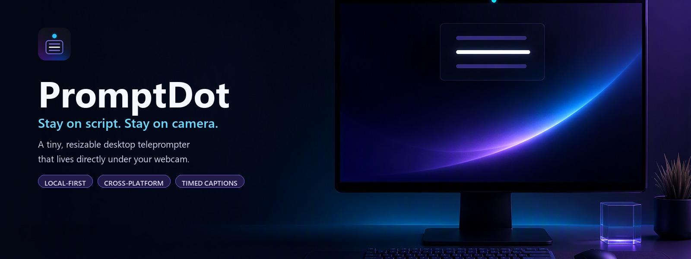

<p align="center">
  
</p>

PromptDot is a small cross-platform desktop teleprompter for recording technical videos, presentations, demos, courses, podcasts, and social media videos while keeping your eye line close to the webcam.

It keeps the script in a compact, resizable window directly under the webcam, so it feels like a natural reading surface rather than a full-screen slide.

## Quick start

1. Download the package for your platform from the [latest GitHub Release](https://github.com/elbruno/PromptDot/releases/latest):

   | Platform | Download |
   |---|---|
   | Windows x64 | `PromptDot-win-x64-Setup.exe` |
   | Linux x64 | `PromptDot-linux-x64.AppImage` |
   | macOS ARM64 | `PromptDot-osx-arm64-Setup.pkg` |

2. Install or launch PromptDot:
   - On Windows, run the `Setup.exe`.
   - On Linux, run `chmod +x PromptDot-linux-x64.AppImage`, then launch it.
   - On macOS, open the `.pkg` and follow the installer.
3. Type, paste, or load a `.txt`, `.md`, `.srt`, or `.vtt` script.
4. Adjust the reading speed for plain text, or use the timestamps already present in SRT and WebVTT captions.
5. Select **Prompter**, resize the window, and position it directly under the webcam.
6. Select **Play**, or navigate manually with the controls.

> [!WARNING]
> The current packages are not code-signed. Windows SmartScreen and macOS Gatekeeper may display warnings until project signing is configured.

### Keyboard controls

These shortcuts work inside PromptDot when the script editor is not receiving text input:

| Key | Action |
|---|---|
| Space | Play or pause |
| Right Arrow | Next cue |
| Left Arrow | Previous cue |
| Home | Return to the beginning |

## Documentation

| Guide | Purpose |
|---|---|
| [Documentation home](docs/README.md) | Entry point for all user and contributor documentation |
| [Installation guide](docs/installation.md) | Download, installation, updates, source setup, and uninstall |
| [User guide](docs/user-guide.md) | Illustrated guide to scripts, playback, appearance, and keyboard controls |
| [Troubleshooting](docs/troubleshooting.md) | Common launch, file, window, font, and settings problems |
| [Timed caption formats](docs/timed-caption-formats.md) | Standards research and PromptDot's SRT/WebVTT design |
| [Distribution and updates](docs/distribution.md) | Release automation, native packages, update behavior, and signing |
| [Platform validation](docs/platform-validation.md) | Current Windows, Linux, macOS, and CI validation status |
| [Architecture](docs/architecture.md) | Project boundaries and technical design |

## Features

- Type or paste a script.
- Load local `.txt`, `.md`, `.srt`, and `.vtt` files.
- Open a separate, movable, resizable Prompter window.
- Place or re-center the Prompter at the top-center of the current Windows display.
- Navigate manually with buttons or application keyboard shortcuts.
- Advance automatically using a configurable 60-300 WPM reading speed.
- Advance SRT and WebVTT captions using their authored timestamps.
- Show previous, current, and next cues with the current cue visually dominant.
- Choose System, Light, or Dark application appearance.
- Choose Studio Dark, Studio Light, or High Contrast Prompter themes.
- Configure font family, size, weight, alignment, line spacing, and cue opacity.
- Keep the Prompter always on top where supported.
- Persist preferences and Prompter window geometry locally.
- Check for and install updates only when requested.
- Preserve Unicode text, including accents, CJK scripts, Greek, and emoji.

## Privacy

PromptDot runs locally and requires no cloud services or internet connection for teleprompter features. It does not use AI, Azure, speech recognition, microphone access, accounts, telemetry, or analytics. It contacts GitHub only when the user explicitly selects **Check for updates**.

## Supported platforms

The application targets Uno Platform Skia Desktop for Windows, macOS, and Linux.

- Windows launch, two-window behavior, automatic playback, top-center placement, lifecycle, packaging, and updates have been validated.
- Linux x64 and macOS ARM64 self-contained packages are published automatically.
- Native macOS and Linux interactive behavior still requires additional testing on those operating systems. See [platform validation](docs/platform-validation.md).

## Roadmap

- **v0.1:** local teleprompter, script playback, top-center window, themes, typography, resize, settings, desktop packages, and updates.
- **v0.2:** timed SRT and WebVTT scripts, followed by optional local/offline speech following.
- **v0.3:** optional speech-provider integrations.

Speech and cloud features are not part of v0.1 and must never be required for the core teleprompter.

## Development

Most users should download a release package. This section is for contributors and developers building PromptDot from source.

### Prerequisites

- .NET 10.0.401 SDK or a compatible .NET 10 servicing update
- Uno Platform desktop development prerequisites

See the [installation guide](docs/installation.md) and the [Uno Platform getting started documentation](https://platform.uno/docs/articles/getting-started/) for operating-system-specific requirements.

### Build and test

From the repository root:

```bash
dotnet restore
dotnet build
dotnet test
```

Run the desktop application:

```bash
dotnet run --project src/PromptDot.App/PromptDot.App.csproj
```

### Architecture

The solution keeps portable behavior in `PromptDot.Core` and desktop/UI behavior in `PromptDot.App`.

- `PromptDot.Core`: script parsing, cue navigation, playback state and timing, validated settings, JSON serialization, and window-position calculations.
- `PromptDot.App`: Uno XAML, ViewModels, file picker, timers, windows, platform positioning, local settings storage, and updates.
- `PromptDot.Core.Tests`: focused unit tests for portable domain behavior.

See [architecture.md](docs/architecture.md) for details.

### Contributing

Keep changes focused, preserve the Core/UI dependency boundary, add tests with core functionality, and use current stable package releases only. Do not introduce required speech, AI, Azure, cloud, telemetry, or internet dependencies into the core teleprompter.

The detailed requirements and implementation order are in the [MVP implementation plan](docs/PromptDot%20v0.1%20MVP%20Implementation%20Plan.md).

## License

See [LICENSE](LICENSE).
