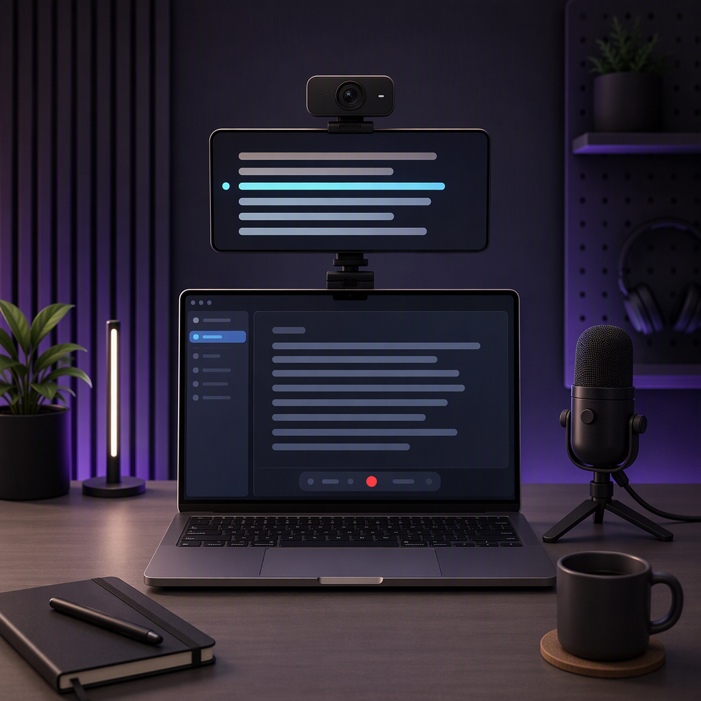
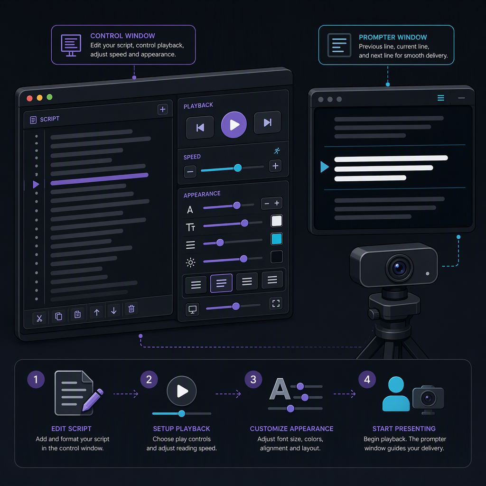

# PromptDot

> A tiny teleprompter that lives next to your camera.

PromptDot is a small cross-platform desktop teleprompter for recording technical videos, presentations, demos, courses, podcasts, and social media videos while keeping your eye line close to the webcam.

<p align="center">
  
</p>

> [!NOTE]
> PromptDot v0.1 is implemented and available from source. Prebuilt installers and signed release packages are not published yet.

## Features

- Type or paste a script.
- Load local `.txt` and `.md` files.
- Open a separate, movable, resizable Prompter window.
- Place or re-center the Prompter at the top-center of the current Windows display.
- Navigate manually with buttons or application keyboard shortcuts.
- Advance automatically using a configurable 60-300 WPM reading speed.
- Show previous, current, and next cues with the current cue visually dominant.
- Choose System, Light, or Dark application appearance.
- Choose Studio Dark, Studio Light, or High Contrast Prompter themes.
- Configure font family, size, weight, alignment, line spacing, and cue opacity.
- Keep the Prompter always on top where supported.
- Persist preferences and Prompter window geometry locally.
- Preserve Unicode text, including accents, CJK scripts, Greek, and emoji.

## Quick start

Build and launch PromptDot from source:

```bash
git clone https://github.com/elbruno/PromptDot.git
cd PromptDot
dotnet restore
dotnet run --project src/PromptDot.App/PromptDot.App.csproj
```

1. Launch PromptDot.
2. Type, paste, or load a script.
3. Adjust playback and appearance settings.
4. Select **Prompter**.
5. Resize or move the Prompter as needed, then select **Re-center**.
6. Select **Play**, or use the keyboard controls.

### Keyboard controls

These shortcuts work inside PromptDot when the script editor is not receiving text input:

| Key | Action |
|---|---|
| Space | Play or pause |
| Right Arrow | Next cue |
| Left Arrow | Previous cue |
| Home | Return to the beginning |

## Documentation

| Guide | Purpose |
|---|---|
| [Documentation home](docs/README.md) | Entry point for all user and contributor documentation |
| [Installation guide](docs/installation.md) | Prerequisites, source setup, launch, publish, update, and uninstall |
| [User guide](docs/user-guide.md) | Scripts, playback, appearance, keyboard controls, and recommended workflow |
| [Troubleshooting](docs/troubleshooting.md) | Common launch, file, window, font, and settings problems |
| [Platform validation](docs/platform-validation.md) | Current Windows, Linux, macOS, and CI validation status |
| [Architecture](docs/architecture.md) | Project boundaries and technical design |

<p align="center">
  
</p>

<p align="center"><em>Conceptual workflow illustration. The exact application interface may differ.</em></p>

## Privacy

PromptDot v0.1 runs completely locally and requires no cloud services or internet connection. It does not use AI, Azure, speech recognition, microphone access, accounts, telemetry, or analytics.

## Supported platforms

The application targets Uno Platform Skia Desktop for Windows, macOS, and Linux.

- Windows launch, two-window behavior, automatic playback, top-center placement, and lifecycle have been validated.
- Linux x64 and macOS ARM64 framework-dependent publishes have been validated.
- Native macOS and Linux interactive behavior still requires testing on those operating systems. See [platform validation](docs/platform-validation.md).

## Development prerequisites

- .NET 10.0.401 SDK or a compatible .NET 10 servicing update
- Uno Platform desktop development prerequisites

See the [installation guide](docs/installation.md) and the [Uno Platform getting started documentation](https://platform.uno/docs/articles/getting-started/) for operating-system-specific requirements.

## Build and test

From the repository root:

```bash
dotnet restore
dotnet build
dotnet test
```

Run the desktop application:

```bash
dotnet run --project src/PromptDot.App/PromptDot.App.csproj
```

## Architecture

The solution keeps portable behavior in `PromptDot.Core` and desktop/UI behavior in `PromptDot.App`.

- `PromptDot.Core`: script parsing, cue navigation, playback state and timing, validated settings, JSON serialization, and window-position calculations.
- `PromptDot.App`: Uno XAML, ViewModels, file picker, timers, windows, platform positioning, and local settings storage.
- `PromptDot.Core.Tests`: focused unit tests for portable domain behavior.

See [architecture.md](docs/architecture.md) for details.

## Roadmap

- **v0.1:** local teleprompter, script playback, top-center window, themes, typography, resize, settings, and desktop support.
- **v0.2:** optional local/offline speech following.
- **v0.3:** optional speech-provider integrations.

Speech and cloud features are not part of v0.1 and must never be required for the core teleprompter.

## Contributing

Keep changes focused, preserve the Core/UI dependency boundary, add tests with core functionality, and use current stable package releases only. Do not introduce speech, AI, Azure, cloud, telemetry, or internet dependencies into v0.1.

The detailed requirements and implementation order are in the [MVP implementation plan](docs/PromptDot%20v0.1%20MVP%20Implementation%20Plan.md).

## License

See [LICENSE](LICENSE).