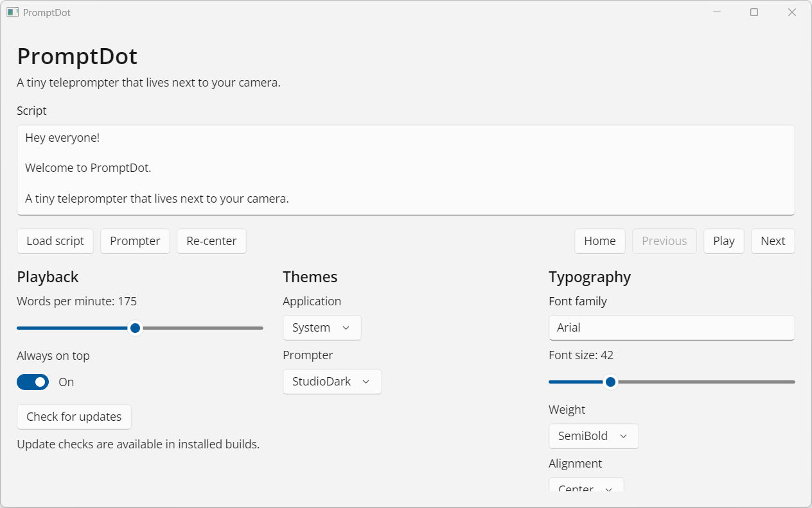
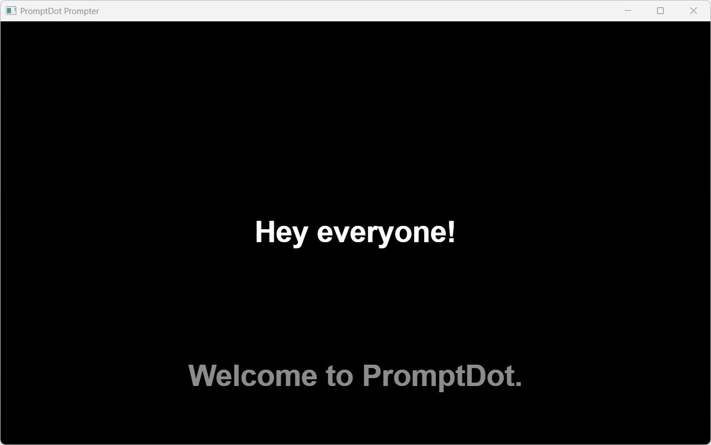

# PromptDot user guide

PromptDot uses two windows:

- The **Control Window** contains the script editor, playback controls, speed, themes, and typography settings.
- The **Prompter Window** presents the previous, current, and next cues close to your webcam.

  

<em>The Control Window manages the script, playback, appearance, and updates.</em>

## Prepare a script

You can type or paste text directly into the **Script** editor.

PromptDot treats paragraphs separated by blank lines as individual cues. Short, focused paragraphs are easier to read naturally than long blocks.

You can also select **Load script** to open a local `.txt` or `.md` file. Loading a file replaces the current editor content.

PromptDot preserves Unicode text, including accents, emoji, Greek, CJK scripts, and other supported characters.

## Open and position the Prompter

1. Select **Prompter**.
2. Move or resize the Prompter Window to fit your recording layout.
3. Select **Re-center** to place it at the top-center of the current display.
4. Leave **Always on top** enabled when you want the Prompter to remain visible over other applications.

  

<em>The Prompter is shown enlarged for readability. Resize it to a compact window directly under the webcam during normal use.</em>

For the best eye line, place the Prompter directly below or beside the webcam. Keep it narrow enough that your eyes do not travel noticeably across the screen.

## Control playback

Use the controls in the Control Window:

| Control | Action |
|---|---|
| **Home** | Return to the first cue |
| **Previous** | Move back one cue |
| **Play** | Start automatic cue advancement |
| **Pause** | Pause automatic advancement |
| **Next** | Move forward one cue |

The **Words per minute** slider controls automatic timing from 60 to 300 WPM. Start around 120 to 150 WPM for conversational delivery, then adjust for your script and speaking style.

Playback stops at the end of the script. Manual navigation remains available while playback is paused.

## Keyboard controls

These shortcuts work while focus is inside PromptDot and the script editor is not receiving text input:

| Key | Action |
|---|---|
| Space | Play or pause |
| Right Arrow | Next cue |
| Left Arrow | Previous cue |
| Home | Return to the beginning |

Click outside the script editor before using shortcuts. When the editor has focus, typing and cursor navigation take priority.

## Customize the application

### Application theme

Choose **System**, **Light**, or **Dark** for the Control Window.

### Prompter theme

Choose a presentation theme:

- **Studio Dark**
- **Studio Light**
- **High Contrast**

### Typography

You can configure:

- Font family
- Font size from 18 to 120
- Font weight
- Text alignment
- Line spacing
- Background opacity
- Previous cue opacity
- Next cue opacity

The current cue remains visually dominant. Lower opacity for adjacent cues reduces distraction, while higher opacity makes context easier to scan.

If a font is unavailable, enter the name of a font installed on your operating system. Font availability differs across Windows, macOS, and Linux.

## Saved preferences

PromptDot saves playback speed, appearance settings, always-on-top preference, and Prompter window geometry locally.

PromptDot does not save your script. Keep the original `.txt` or `.md` file if you need to reuse it.

## Update PromptDot

Select **Check for updates** in the Control Window. PromptDot contacts the public GitHub Releases feed only after this action.

If an update is available, the button changes to **Install `<version>`**. Select it to download the verified package, save your settings, apply the update, and restart PromptDot.

Updates are available only in installed release builds. Source checkouts and `dotnet run` builds must be updated with Git.

## Recommended recording workflow

1. Split the script into short paragraph cues.
2. Load or paste the script.
3. Open and position the Prompter near the webcam.
4. Select a comfortable font size and line spacing.
5. Test the reading speed with the first few cues.
6. Return to **Home**.
7. Start recording, then select **Play**.
8. Use **Previous** or **Next** whenever you need to recover manually.

## Privacy

PromptDot v0.1 runs locally. It does not use speech recognition, microphone access, AI, Azure, cloud services, accounts, telemetry, or analytics. An internet connection is used only when you explicitly check for or install an update from GitHub Releases.
